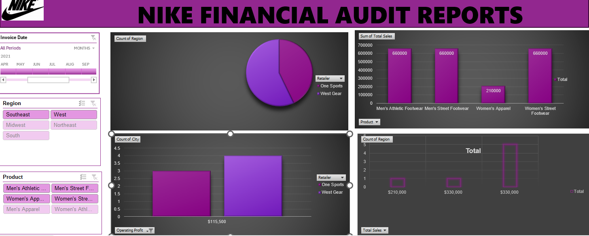
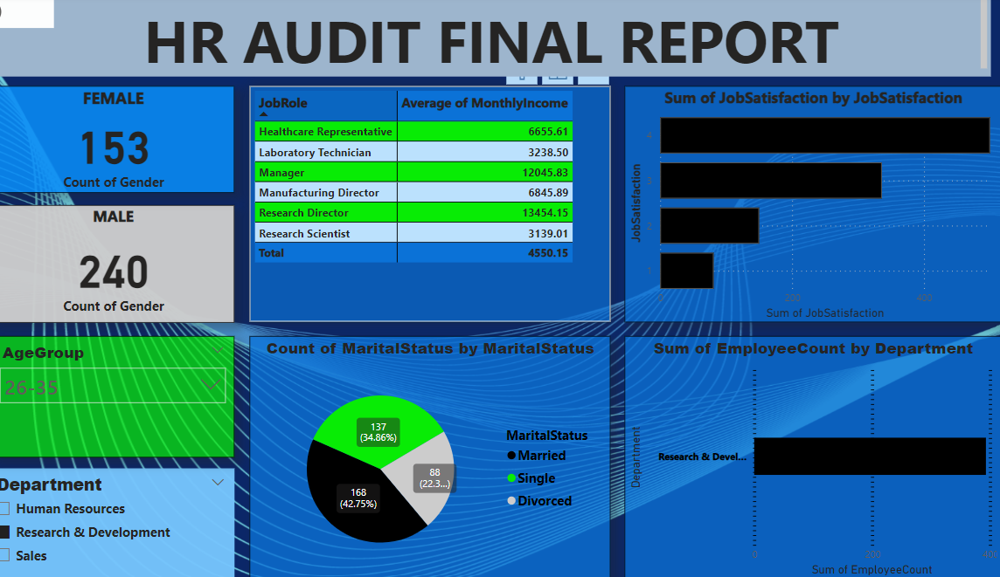

# JENNIFER ARINZE DATA ANALYSIS PORTFOLIO
**Project 1**

[Title: Nike financial audit report 2021](https://github.com/jenniferdata/portfolio/tree/main)

Description:A critical analysis was carried out on Nike retial partners(USA),to provide an insight on the financial position of its products across different retailers and cities.The product unit sold and total operating profit was also analysed.

**Project 2**

[Title: HR AUDITS](https://github.com/jenniferdata/portfolio/tree/main)

Description:A streamlined analysis was carreid out on the Hr audits NHSP,to provide an insight on the demographic and categories of staff members and in the organisation.

